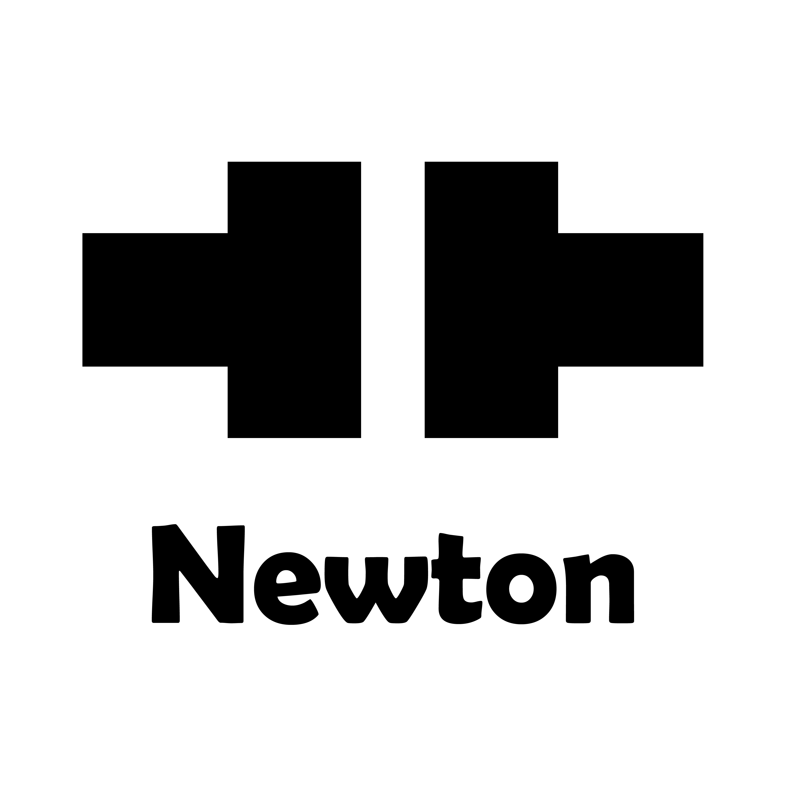

<div id="top"></div>


[](https://app.travis-ci.com/hakonmagnus/newton)
[](https://ci.appveyor.com/project/hakonmagnus/newton/branch/master)
[](https://codecov.io/gh/hakonmagnus/newton)
[](https://www.codacy.com/gh/hakonmagnus/newton/dashboard?utm_source=github.com&amp;utm_medium=referral&amp;utm_content=hakonmagnus/newton&amp;utm_campaign=Badge_Grade)


<br />
<div align="center">
  <a target="_blank" href="https://newtonframework.com">
    
  </a>

  <h3 align="center">Newton C++ Web Framework</h3>

  <p align="center">
    A web framework that allows you to create compiled web servers.
    <br />
    <a target="_blank" href="https://newtonframework.com/docs"><strong>Explore the docs »</strong></a>
    <br />
    <br />
    <a target="_blank" href="https://newtonframework.com">Homepage</a>
    ·
    <a target="_blank" href="https://github.com/hakonmagnus/newton/issues">Report a Bug</a>
    ·
    <a target="_blank" href="https://github.com/hakonmagnus/newton/issues">Request a Feature</a>
  </p>
</div>

<details>
  <summary>Table of Contents</summary>
  <ol>
    <li>
      <a href="#about">About</a>
      <ul>
        <li><a href="#built-with">Built With</a></li>
      </ul>
    </li>
    <li>
      <a href="#getting-started">Getting Started</a>
      <ul>
        <li><a href="#prerequisites">Prerequisites</a></li>
        <li><a href="#building">Bulding</a></li>
        <li><a href="#usage">Usage</a></li>
      </ul>
    </li>
    <li><a href="#contributing">Contributing</a></li>
    <li><a href="#license">License</a></li>
    <li><a href="#contact">Contact</a></li>
    <li><a href="#acknowledgments">Acknowledgments</a></li>
  </ol>
</details>

## About

Newton is a full-stack web framework written in and for the C++ language. It has the added
advantage over other frameworks of being compiled. Your web application is written in C++
and NTL (Newton Template Language), which gets converted to pure C++ and is then compiled
using a C++ compiler. This allows you to make a purely binary executable web server with
no language interpretation required, which makes it very fast.

The NTP package manager application can be used to generate your project's build system,
add Newton modules you wish to use, and compile the NTL code into C++ for compilation.
Alternatively, you can omit the use of the package manager and manually link your application
to the Newton core library, in which case you must take care of dependencies manually, and you
cannot compile NTL into C++ directly. Due to this nature of the design, Newton is both a framework
and a library.

<p align="right">(<a href="#top">back to top</a>)</p>

### Built With

Newton uses the following technologies:

 * A C++17-compatible compiler
 * [CMake](https://cmake.org/)
 * [OpenSSL](https://www.openssl.org/)

<p align="right">(<a href="#top">back to top</a>)</p>

## Getting Started

You may choose to simply clone the repository and link directly to Newton as a library and
take care of linking to modules yourself, but in that case you cannot use the template language
It would be best to build then NTP package manager, or use an installer from the website.

<p align="right">(<a href="#top">back to top</a>)</p>

### Prerequisites

To build Newton, you will need CMake, and a C++17-capable compiler. On Linux, you can run:

```sh
sudo apt update
sudo apt install cmake
```

You must also clone the repository:

```sh
git clone https://github.com/hakonmagnus/newton.git
cd newton
```

<p align="right">(<a href="#top">back to top</a>)</p>

### Building

When you have cloned the repository, you should create and enter a build directory
before running CMake followed by make:

```sh
mkdir build
cd build
cmake ..
make
make install
```

<p align="right">(<a href="#top">back to top</a>)</p>

### Usage

You can run the NTP command and build your project:

```sh
ntp --version
ntp init
ntp build
```

Please read the [NTP documentation](https://newtonframework.com/docs/ntp) for more information.

<p align="right">(<a href="#top">back to top</a>)</p>

## Contributing

Please see [CONTRIBUTING.md](./CONTRIBUTING.md) for information about contributing to Newton
Framework.

<p align="right">(<a href="#top">back to top</a>)</p>

## License

This project is licensed under the [MIT License](./LICENSE).

<p align="right">(<a href="#top">back to top</a>)</p>
